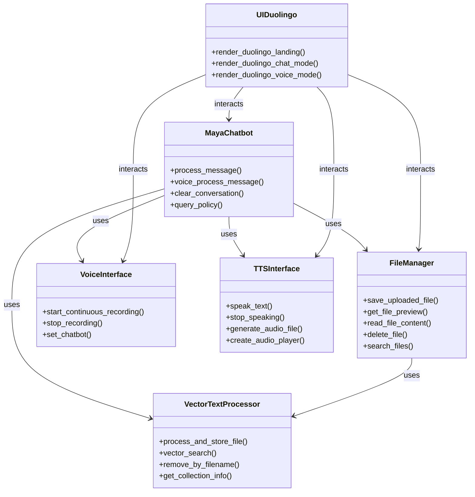
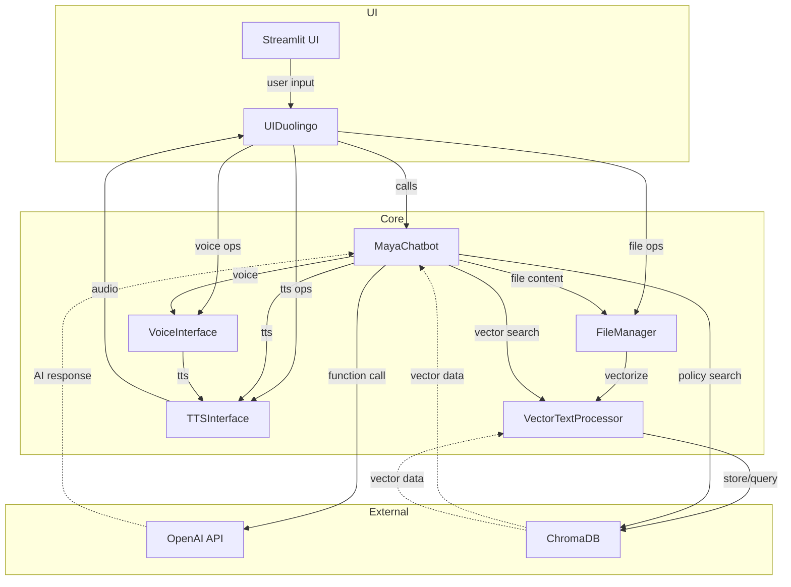
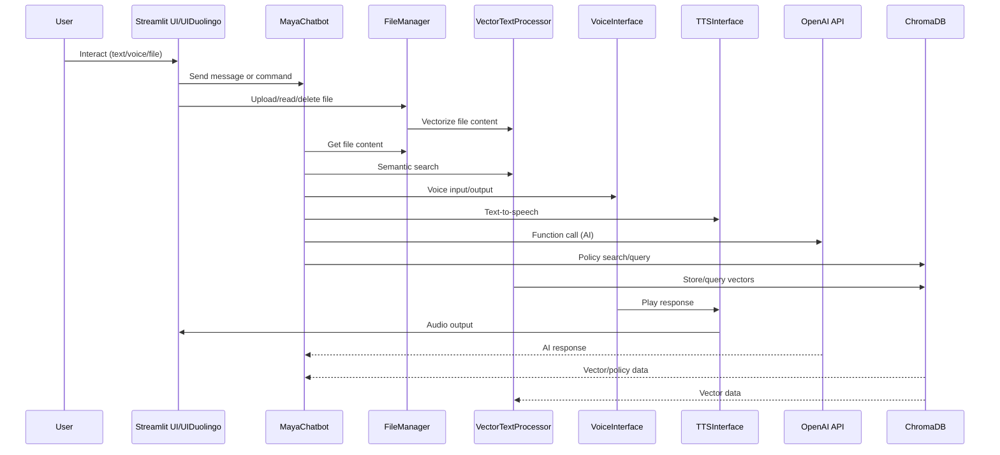
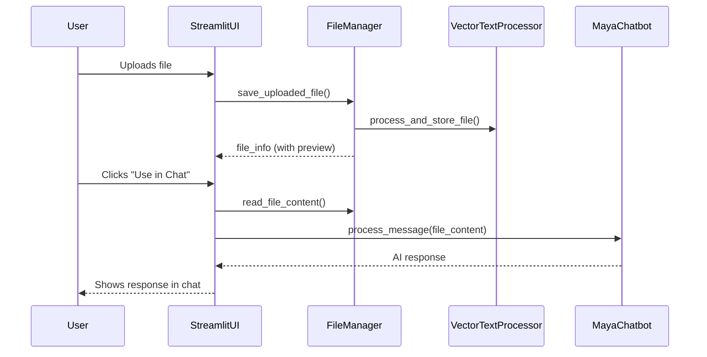

# Maya Chatbot – Components & Architecture Overview

## Overview

**Maya Chatbot** (workshop_week2) is a modular AI assistant system supporting text/voice chat, file management, and advanced data processing. It is built for extensibility and maintainability, with clear separation between core logic, UI, file/vector management, and voice/text-to-speech features. The system leverages OpenAI, ChromaDB, and Streamlit for a modern, interactive user experience. Its primary purpose is to act as a **Company Policy Chatbot**, providing employees with accurate and context-aware information based on internal documentation.

---

## Directory Structure

```
workshop_week2/
├── components/
│   ├── __init__.py
│   ├── chatbot_core.py
│   ├── file_manager.py
│   ├── function_constants.py
│   ├── tts_interface.py
│   ├── ui_duolingo.py
│   ├── vector_text_processor.py
│   └── voice_interface.py
├── docs/
│   └── file_manager_guide.md
├── import-hugging.py
├── movies.json
├── streamlit_chatbot.py
└── sample_files/
    └── ...
```

---

## Architecture Diagram

```mermaid
flowchart TD
    A[User] -->|Web UI| B[Streamlit UI]
    B -->|API/Session| C[MayaChatbot (chatbot_core.py)]
    B -->|File Ops| D[FileManager]
    D -->|Vectorize| E[VectorTextProcessor]
    C -->|Function Calling| F[OpenAI]
    C -->|Policy Search| G[ChromaDB]
    B -->|Voice| H[VoiceInterface/TTSInterface]
```

---

## Component Relationship Diagrams

### Class Diagram: Main Components and Their Relationships


*This diagram shows the main classes/components and their usage relationships.*

### Flowchart: Data and Control Flow Among Components


*This flowchart illustrates how data and commands move between UI, core logic, and external services.*

### Sequence Diagram: End-to-End User Interaction


*This sequence diagram shows a typical flow from user action through the system's components and back.*

---

## Key Modules

### 1. `chatbot_core.py`
- **Purpose**: Main chatbot logic, OpenAI integration, function calling, and response formatting.
- **Features**:
  - Handles both text and voice conversations.
  - Supports function calling for guides, mock data, FAQs, and policy lookups.
  - Integrates with ChromaDB for semantic search and context retrieval.
  - Formats responses for different data types (guides, mock data, standard answers).
- **API**:
  - `process_message(user_question, filenames=None)`
  - `voice_process_message(user_question)`
  - `clear_conversation()`
  - `query_policy(...)`

### 2. `file_manager.py`
- **Purpose**: Handles file upload, storage, preview, deletion, and integration with vector search.
- **Features**:
  - Saves uploaded files with unique names (MD5 hash).
  - Provides content preview and full content reading.
  - Integrates with `VectorTextProcessor` for vectorizing and storing file content in ChromaDB.
  - Supports file search by name/content and deletion (with vector DB cleanup).
- **API**:
  - `save_uploaded_file(uploaded_file)`
  - `get_file_preview(file_path, extension)`
  - `read_file_content(file_path)`
  - `delete_file(file_info)`
  - `search_files(query, files)`

### 3. `vector_text_processor.py`
- **Purpose**: Reads, chunks, and vectorizes text from files (PDF, TXT, MD), storing them in ChromaDB for semantic search.
- **Features**:
  - Supports multiple file types and robust error handling.
  - Uses SentenceTransformer for embeddings (with hash fallback).
  - Provides chunking, embedding, and search utilities.
  - Can remove documents by filename.
- **API**:
  - `process_and_store_file(file_path, use_chunking=True)`
  - `vector_search(query, n_results=5, score_threshold=0.0)`
  - `remove_by_filename(filename)`
  - `get_collection_info()`

### 4. `function_constants.py`
- **Purpose**: Defines OpenAI function calling schemas for guides, mock data, FAQs, and policy lookups.
- **Usage**: Used by `chatbot_core.py` to structure and validate function calls.

### 5. `tts_interface.py`
- **Purpose**: Text-to-speech (TTS) for bot responses using `pyttsx3`.
- **Features**:
  - Can speak text, stop speech, and generate audio files.
  - Provides HTML audio player for Streamlit UI.

### 6. `voice_interface.py`
- **Purpose**: Handles speech-to-text (STT) and microphone input, plus TTS using Hugging Face models.
- **Features**:
  - Continuous voice activity detection and transcription.
  - Integrates with chatbot for voice queries and responses.
  - Cross-platform audio playback support.

### 7. `ui_duolingo.py`
- **Purpose**: Provides Duolingo-inspired UI components for Streamlit (landing page, chat, voice mode, suggestions, etc.).
- **Features**:
  - Custom CSS and layout for a playful, modern interface.
  - Quick suggestion buttons, mode selector, and data/guide cards.

---

## State Management

- **Session State**: Streamlit's `st.session_state` is used to persist file manager, uploaded files, chat history, and UI mode.
- **Chatbot State**: Each chatbot instance maintains its own message history for both text and voice.

---

## User Flows

### Text Chat
1. User enters a message.
2. `MayaChatbot.process_message()` is called.
3. If function calling is triggered, the appropriate function is executed and the response is formatted.
4. The response is displayed in the chat UI.

### Voice Chat
1. User records a message.
2. `VoiceInterface` transcribes and passes it to `MayaChatbot.voice_process_message()`.
3. The response is spoken aloud and shown in the UI.

### File Management
1. User uploads `.txt` or `.md` files.
2. Files are saved, previewed, and can be deleted.
3. Content can be sent to the chatbot for analysis.

### Vector Search
1. Uploaded files are vectorized and stored in ChromaDB.
2. Semantic search is available for context-aware responses.

---

## Error Handling

- All file and vector operations are wrapped in try/except with user feedback via Streamlit.
- Chatbot and voice interface handle API and model errors gracefully, providing fallback messages.

---

## Performance Considerations

- File chunking and vectorization are optimized for large files.
- Embedding model is loaded lazily and cached.
- ChromaDB is used for fast semantic search and retrieval.

---

## Accessibility

- UI is designed for both desktop and mobile.
- Voice features support hands-free interaction.
- All actions provide visual or audio feedback.

---

## Testing

- **Manual**: Use Streamlit UI to test all flows.
- **Automated**: (Recommended) Add unit tests for file management, vector processing, and chatbot logic.

---

## Extension Points

- Add new function schemas in `function_constants.py` for more AI capabilities.
- Implement new UI modes or themes in `ui_duolingo.py`.
- Integrate additional file types or vector DBs in `vector_text_processor.py`.

---

## Example: File-to-Chat Flow



---

## References

- See `docs/file_manager_guide.md` for a detailed breakdown of the file manager logic and UI.
- Each component is documented with docstrings and inline comments.
- [Streamlit Documentation](https://docs.streamlit.io/)
- [ChromaDB](https://docs.trychroma.com/)
- [OpenAI Function Calling](https://platform.openai.com/docs/guides/function-calling)
- [Sentence Transformers](https://www.sbert.net/) 