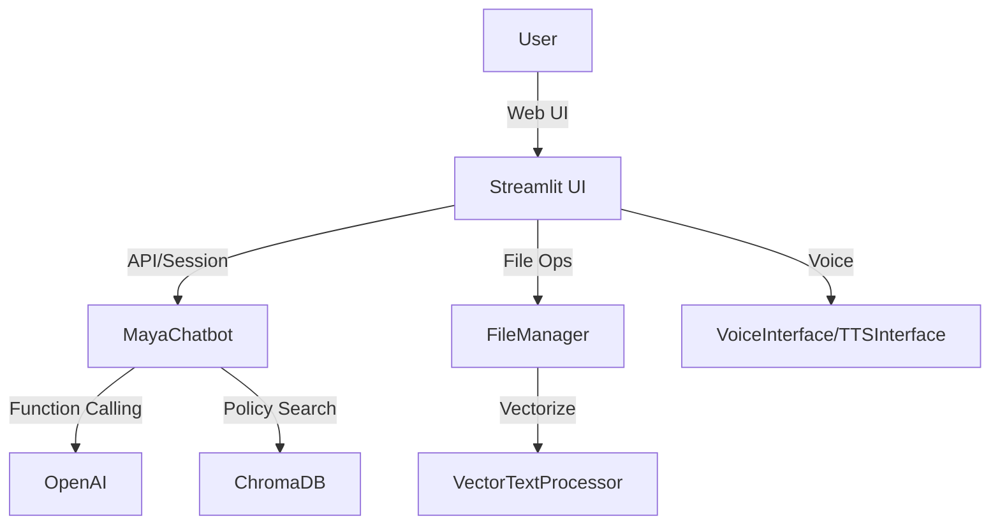
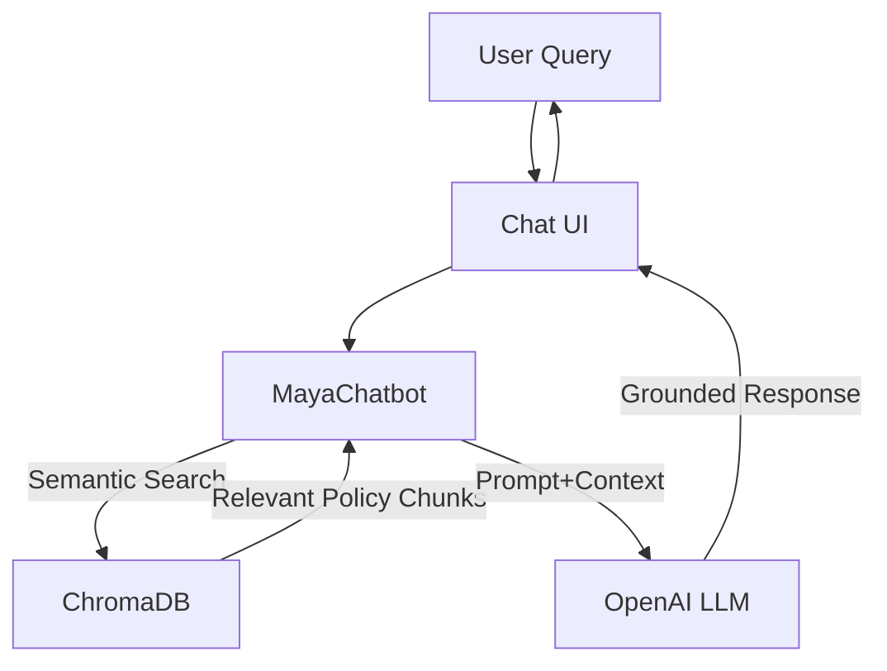
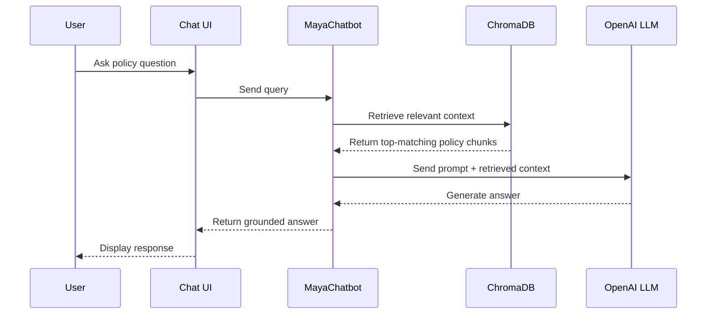
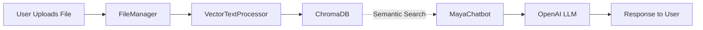

# Maya Chatbot – Group Presentation (RAG Focus)

---

## Slide 1: Introduction & Problem Statement

**The Challenge:**
- Modern organizations need AI assistants that can answer questions accurately, using both general knowledge and their own internal **company policies**.
- Standard LLMs (Large Language Models) often "hallucinate" or lack up-to-date, context-specific information.

**Our Solution:**
- **Maya Chatbot**: An intelligent, context-aware assistant that combines LLM power with document retrieval for grounded, trustworthy answers about **company policies**.
- Supports both text and voice interaction, file upload, and advanced search.

---

## Slide 2: System Architecture Overview

**High-Level Architecture:**
- Modular design: UI, Core Logic, File/Vector Management, Voice, OpenAI, ChromaDB.
- Seamless integration between user interface, AI, and document storage.

**Key Points:**
- Users interact via a modern web UI (text/voice).
- Files are uploaded, vectorized, and stored for semantic search.
- MayaChatbot orchestrates retrieval, generation, and response.

---

## Slide 3: RAG (Retrieval-Augmented Generation) Flow Deep Dive

**What is RAG?**
- **Retrieval-Augmented Generation**: Combines LLMs with external knowledge retrieval for more accurate, context-grounded answers.

**How Maya Implements RAG:**
1. User submits a query (optionally referencing uploaded files).
2. Maya performs semantic search in ChromaDB to find relevant document chunks.
3. Retrieved context is injected into the LLM prompt.
4. OpenAI LLM generates a response grounded in both general and retrieved knowledge.

**Step-by-Step Example:**

---

## Slide 4: Key Features, Benefits & Drawbacks

**Features Enabled by RAG:**
- Context-aware Q&A: Answers grounded in user-uploaded **policy documents**.
- File upload & semantic search: Instantly reference and search your own **policy data**.
- Voice & text modes: Flexible, accessible interaction.
- Modular, extensible design: Easy to add new data sources or features.

**Benefits:**
- **Accuracy**: Reduces hallucinations, increases trust in **policy answers**.
- **Relevance**: Answers are tailored to your **company's context and data**.
- **Empowerment**: Users can teach the AI with their own **policy files**.
- **Scalability**: Architecture supports future growth and new use cases.

**Drawbacks / Limitations:**
- **Retrieval Quality**: If relevant chunks are not retrieved, answers may still lack context or accuracy.
- **Chunking Granularity**: Too large or too small chunks can affect retrieval precision and LLM performance.
- **Latency**: Semantic search and LLM generation add to response time, especially with large document sets.
- **File Type Support**: Current system mainly supports text-based files; other formats (PDF, images, tables) require extra processing.
- **Context Window Limits**: LLMs have a maximum input size; too much retrieved context can be truncated.
- **No Real-Time Data**: RAG only retrieves from indexed **policy documents**, not live web or databases.

---

## Slide 5: Use Cases & Future Directions

**Practical Applications:**
- **Enterprise Knowledge Assistant**: Internal Q&A on **company policies**, onboarding, procedure search.
- **HR & Compliance**: Study assistant for **policy training**, document summarization, voice Q&A.
- **Employee Support**: Automated, document-grounded helpdesk for **policy questions**.
- **Internal Audits**: Literature review on **policy documents**, data-driven insights.

**Future Enhancements:**
- Multi-modal RAG (images, tables, more file types for policies)
- Analytics & usage insights
- Mobile & multi-language support
- Integration with more data sources (APIs, databases)

--- 