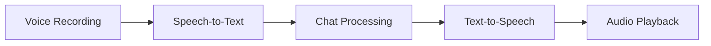

# Maya Advanced FAQ Chatbot - Project Overview

## 🎯 Project Summary
**Maya** là một AI Assistant tiên tiến với giao diện web hiện đại, hỗ trợ cả chat văn bản và giao tiếp bằng giọng nói, được thiết kế theo phong cách UI/UX Thân thiện với trải nghiệm người dùng thân thiện và tương tác cao.

---

## 🏗️ Architecture Overview

```
Maya Chatbot System
├── 🖥️  Frontend Layer (Streamlit UI)
│   ├── UI/UX-inspired Interface
│   ├── Multi-mode Navigation
│   └── Responsive Design
│
├── 🧠 Core Logic Layer
│   ├── OpenAI/Azure Integration
│   ├── ChromaDB Vector Storage
│   └── Function Calling System
│
├── 🎤 Voice Processing Layer
│   ├── Speech-to-Text (SpeechRecognition)
│   ├── Text-to-Speech (Local TTS Model)
│   └── Audio Management (PyAudio/Pygame)
│
└── 💾 Data Layer
    ├── Conversation History
    ├── Vector Embeddings
    └── Session Management
```

---

## ✨ Key Features

### 🌐 **Multi-Modal Interface**
- **Landing Page**: UI/UX-style hero với call-to-action buttons
- **Chat Mode**: Real-time text conversation với structured responses  
- **Voice Mode**: Hands-free voice interaction với visual feedback
- **Data Mode**: AI-powered mock data generation
- **Guides Mode**: Step-by-step tutorial creation

### 🎯 **Core Capabilities**
- **Smart FAQ System**: Context-aware responses với conversation memory
- **Guide Generation**: Auto-create step-by-step tutorials
- **Mock Data Generation**: Generate realistic sample data (JSON, CSV, XML, SQL)
- **Voice Recognition**: Real-time speech-to-text processing
- **TTS Integration**: Local text-to-speech với Hugging Face models

### 🎨 **UI/UX Excellence**
- **UI/UX-Inspired Design**: Modern, playful, engaging interface
- **Responsive Layout**: Works seamlessly across devices
- **Visual Feedback**: Loading states, animations, status indicators
- **Accessibility**: Voice controls, keyboard navigation

---

## 🔧 Technical Stack

### **Backend Technologies**
- **Framework**: Streamlit (Python web framework)
- **AI Integration**: OpenAI GPT models via Azure endpoint
- **Vector Database**: ChromaDB for similarity search
- **Embeddings**: SentenceTransformers for semantic search

### **Voice Technologies**
- **Speech Recognition**: SpeechRecognition library
- **TTS Engine**: 
  - Local: Hugging Face VITS model (mms-tts-eng-local)
  - Fallback: pyttsx3 system TTS
- **Audio Processing**: PyAudio, SoundFile, Pygame

### **Data Management**
- **Session State**: Streamlit session management
- **Conversation History**: In-memory storage với persistence options
- **File Export**: Multiple formats (JSON, CSV, XML, SQL, YAML)

---

## 📁 Project Structure

```
workshop_week2/
├── 📄 streamlit_chatbot.py          # Main application entry point
├── 📄 requirements.txt              # Python dependencies
├── 📄 README.md                     # Comprehensive documentation
│
├── 📂 components/                   # Modular components
│   ├── 🧠 chatbot_core.py          # Core AI logic & OpenAI integration
│   ├── 🎤 voice_interface.py       # Speech-to-text functionality
│   ├── 🔊 tts_interface.py         # Text-to-speech engine
│   ├── 🎨 ui_duolingo.py           # UI/UX-style UI components
│   └── 📦 __init__.py              # Package initialization
│
├── 📂 mms-tts-eng-local/           # Local TTS model files
│   ├── config.json
│   ├── model.safetensors
│   ├── tokenizer_config.json
│   └── vocab.json
│
└── 📂 chroma_db/                   # Vector database storage
    └── chroma.sqlite3
```

---

## 🚀 Core Workflows

### **1. Chat Workflow**


### **2. Voice Workflow**


### **3. Data Generation Workflow**


---

## 🎭 User Experience Journey

### **Landing Experience**
1. **Hero Section**: Welcomes users với Maya mascot
2. **Mode Selection**: Clear options cho different interaction types
3. **Feature Preview**: Quick access to guides, data, Q&A

### **Chat Experience**
1. **Seamless Conversation**: Real-time responses với context awareness
2. **Rich Responses**: Structured data, guides, formatting
3. **Quick Suggestions**: Pre-defined questions để enhance UX
4. **History Management**: Full conversation tracking với clear options

### **Voice Experience**
1. **Auto-start Recording**: Immediate voice activation
2. **Visual Feedback**: Recording status, processing indicators
3. **Natural Conversation**: Hands-free interaction
4. **Audio Responses**: Text-to-speech với stop controls

---

## 🔥 Advanced Features

### **AI Function Calling System**
- **Guide Templates**: Auto-detect tutorial requests
- **Data Templates**: Smart data generation với realistic content
- **FAQ Responses**: Context-aware general information

### **Voice Intelligence**
- **Continuous Recording**: Background voice processing
- **Noise Handling**: Robust speech recognition
- **Local TTS**: Privacy-focused text-to-speech

### **Data Generation Capabilities**
- **Multiple Formats**: JSON, CSV, XML, SQL, YAML, Table
- **Realistic Content**: AI-enhanced sample data
- **Instant Download**: One-click export functionality

---

## 🛠️ Technical Highlights

### **Modular Architecture**
- **Separation of Concerns**: Each component has specific responsibility
- **Easy Maintenance**: Clear code structure và documentation
- **Scalable Design**: Easy to add new features và modes

### **Performance Optimizations**
- **Session State Management**: Efficient state handling
- **Background Processing**: Non-blocking voice operations
- **Smart Caching**: Reduced API calls và faster responses

### **Error Handling & Reliability**
- **Graceful Degradation**: Fallback options cho voice features
- **User Feedback**: Clear error messages và loading states
- **Cross-platform Support**: Windows, macOS, Linux compatibility

---

## 🎯 Use Cases

### **Educational**
- **Tutorial Creation**: Generate step-by-step learning guides
- **Q&A Support**: Instant answers cho học sinh và educators
- **Voice Learning**: Hands-free educational interaction

### **Development**
- **Mock Data Generation**: Realistic test data cho development
- **API Documentation**: Auto-generate guide content
- **Prototype Support**: Quick FAQ systems cho projects

### **Business**
- **Customer Support**: AI-powered FAQ automation
- **Training Materials**: Generate procedural documentation
- **Data Analysis**: Quick sample data cho presentations

---

## 🔮 Future Enhancements

### **Planned Features**
- [ ] **Multi-language Support**: Voice và text in multiple languages
- [ ] **Custom Voice Training**: Personalized TTS voices
- [ ] **Advanced Analytics**: Conversation insights và usage patterns
- [ ] **API Integration**: RESTful API cho external applications
- [ ] **Mobile App**: Native mobile applications
- [ ] **Real-time Collaboration**: Multi-user chat sessions

### **Technical Improvements**
- [ ] **WebRTC Integration**: Better voice quality và latency
- [ ] **Cloud Deployment**: Scalable hosting solutions
- [ ] **Database Persistence**: Long-term conversation storage
- [ ] **Advanced AI Models**: Fine-tuned models cho specific domains

---

## 💡 Key Innovation Points

1. **UI/UX-Style UX**: Gamified, engaging interface cho AI interaction
2. **Local TTS Integration**: Privacy-focused voice synthesis
3. **Function Calling Architecture**: Structured AI responses với templates
4. **Multi-modal Design**: Seamless switching between text và voice
5. **Modular Component System**: Maintainable, scalable codebase

---

## 🏆 Project Impact

**Maya Chatbot** demonstrates modern AI application development với focus on:
- **User Experience**: Intuitive, engaging interface design
- **Technical Excellence**: Clean architecture và best practices  
- **Accessibility**: Multiple interaction modes cho diverse users
- **Innovation**: Creative use of AI technologies và voice integration
- **Scalability**: Foundation cho future enhancements và features

---

*Built with ❤️ by TuTT42 Teams • Always learning, always helping*
